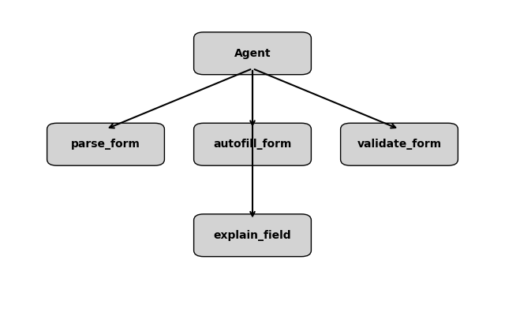

# Digital Paperwork Butler (Concierge Agent)

## Problem & Solution

Filling out administrative paperwork (insurance claims, visa forms, scholarship applications, government documents, etc.) is tedious and error‑prone.  Each form uses slightly different field names, asks for the same information in different ways, and often requires reading confusing instructions.  People waste hours manually copying data into countless boxes and still risk having their applications rejected due to missing or invalid fields.

The **Digital Paperwork Butler** is an AI concierge agent that automates this burden.  Built with Google’s Agent Development Kit (ADK) and the Gemini model, the agent:

* **Parses and analyses PDF forms** to identify all fields (using the `pypdf` library).
* **Autofills known details** from a secure user profile (JSON), reducing manual typing.
* **Validates missing or malformed fields** and produces a concise checklist of what you still need to provide.
* **Generates a completed PDF** ready for submission.
* **Explains confusing form language** on request using Gemini’s language understanding.

The result is a polite digital butler that saves hours of manual work and reduces submission errors.

## Architecture Overview

The solution is implemented as a single‑agent system using the Python ADK.  The agent uses the Gemini language model to orchestrate calls to several custom function tools:

| Component              | Description |
|---|---|
| **Agent (Gemini)** | A root `Agent` from ADK configured with the `gemini-pro` model.  The agent interprets the user’s natural language requests, decides which tool to call, and guides the conversation. |
| **`parse_form` tool** | Reads a PDF file using `pypdf` and returns a dictionary of form field names and their current values. |
| **`autofill_form` tool** | Accepts a PDF path and a user data dictionary.  It fills any blank fields with values from the user profile and returns the path to the newly written PDF. |
| **`validate_form` tool** | Accepts a dictionary of field values and returns a list of missing or invalid fields based on simple rules (empty strings, invalid dates, etc.). |
| **`explain_field` tool** | Uses the Gemini model to generate a plain‑language explanation of a given form field (e.g., “What does ‘Address Line 2’ mean?”).  This showcases how the LLM can be leveraged beyond simple form filling. |

The agent stores the user’s personal data in `metadata/user_data.json`.  This file is loaded at runtime and never hard‑codes any sensitive information into the codebase.  Users can update the JSON file with their own details.  The ADK state mechanism is used to pass this data into tools when needed.



*Figure 1.  High‑level data flow of the Digital Paperwork Butler.*

## Setup Instructions

These steps assume you are running the code in Google AI Studio or another environment with Python 3.10+.

1. **Clone or download this repository** to your local machine or AI Studio workspace.

2. **Create and activate a virtual environment** (recommended):

   ```bash
   python3 -m venv .venv
   source .venv/bin/activate
   ```

3. **Install dependencies**:  The project uses the Google Agent Development Kit and the `pypdf` library.  Run:

   ```bash
   pip install -r requirements.txt
   ```

4. **Add your personal data** to `metadata/user_data.json`.  This file contains key–value pairs used to autofill form fields.  For example:

   ```json
   {
     "first_name": "Ayanokouji",
     "last_name": "Kiyotaka",
     "address_line_1": "123 Example Street",
     "address_line_2": "Apartment 4B",
     "city": "Name here",
     "state": "State here",
     "postal_code": "Pin here",
     "country": "Name here",
     "phone_number": "+Country_Code Phone"
   }
   ```

5. **Run the agent locally**.  You can start an interactive session by executing:

   ```bash
   python agent.py
   ```

   Once running, converse with the agent using natural language.  For example:

   ```text
   User: Fill out this PDF and let me know what information I need to provide.
   Agent: Understood.  Upload the PDF file path.
   ...
   ```

   The agent will call the appropriate tools and generate a filled PDF in the `output/` directory.

## How It Works

1. **User Input** – You ask the agent to help with a specific form.  The agent uses the `parse_form` tool to identify all fields and returns a summary.

2. **Auto‑population** – The agent uses your stored data to fill out as much of the form as possible via the `autofill_form` tool.  Any fields that cannot be filled are highlighted.

3. **Validation** – The `validate_form` tool checks that required fields are not empty and that date fields follow the format `YYYY‑MM‑DD`.  It returns a list of missing or invalid items.

4. **Clarification and Guidance** – If you ask, “What does ‘Address Line 2’ mean?”, the agent calls the `explain_field` tool, which uses Gemini to generate a brief explanation.

5. **Output** – When ready, the agent writes a completed PDF to the `output/` directory and tells you where to find it.

## Meeting the Capstone Rubric

The Digital Paperwork Butler aligns with the rubric as follows:

### Category 1 – The Pitch (30 points)

| Sub‑criterion | How we satisfy it |
|---|---|
| **Core Concept & Value** (15 pts) | Automates form filling, saves users hours, reduces stress and rejection rates.  Uses an agent to orchestrate parsing, filling, validation, and explanation tasks – a clear, central use of agents. |
| **Writeup** (15 pts) | This README doubles as the project write‑up.  It clearly explains the problem, proposed solution, architecture, installation steps, and the project’s benefits. |

### Category 2 – Implementation (70 points)

| Sub‑criterion | How we satisfy it |
|---|---|
| **Technical Implementation** (50 pts) | Uses the ADK to build a multi‑tool agent.  Implements at least three key concepts from the course: custom function tools, state management (storing user data), and integration of an LLM (Gemini) for language tasks.  Code is commented and modular. |
| **Documentation** (20 pts) | A comprehensive README with setup instructions, architecture diagram, and usage examples.  The code is accompanied by inline comments. |

### Bonus Opportunities

* **Effective Use of Gemini** – The `explain_field` tool uses Gemini to translate bureaucratic jargon into simple language.
* **Agent Deployment** – The code includes notes on deploying to Agent Engine or Cloud Run (see below).  Deployment is optional but supported.
* **YouTube Video** – You can record a short demo showing the agent filling a form and publish it for bonus points.

## Deployment Notes

You can deploy this agent using Google’s Agent Engine or Vertex AI Agent Builder.  After verifying that your code runs locally, follow the Agent Engine deployment guide:

1. **Write a `adk.yaml` configuration** describing the agent (model, tools, etc.).
2. **Package the code** and push it to a container registry.
3. **Deploy** on Agent Engine or Cloud Run.

Detailed deployment steps are beyond the scope of this README but can be derived from the official ADK documentation.

## License and Disclaimer

This project is open‑sourced under the MIT license.  It is intended for educational purposes.
